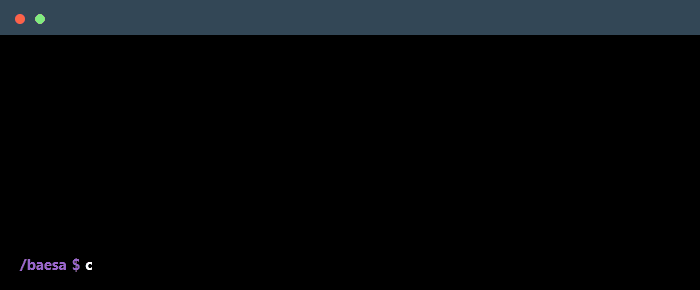

### Languages & Frameworks

### Databases & Tools

### Connect with me!

### Employer?

> [!IMPORTANT]
> [Download my resume](https://docs.google.com/document/d/1YRcnJ6LRu96VLr5wiuW_UIcgYtYXfEC1VtbUXt9kpoQ/export?format=pdf)

